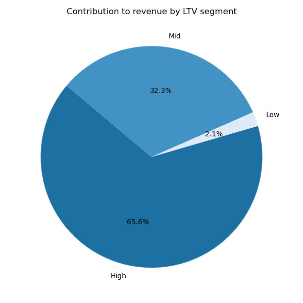

# Contoso Sales Analysis

This project harnesses the Contoso sales relational database, which integrates detailed sales transaction records with rich datasets on customer demographics and product specifications. SQL queries are written to uncover temporal trends in sales, generating visualised insights on business performance to aid stakeholders on points of potential improvements. 

## Background

The project is made possible thanks to **Microsoft's Contoso** datasets, which provide ficticious demonstrations of real-world datasets for training purposes. 

A further thanks to **Luke Barousse**'s Intermediate SQL Course for Data Analytics, equipping me with the skillset necessary to tackle these datasets with the skills demonstrated in this project's queries. 

## Project Goals

By querying the relational database on sale, customer and product records, this project sought answers to considered questions which aimed to generate useful recommendations for the selling company. In particular, three initial key questions were considered: 

1. How does customer Lifetime Value (LTV) vary across the dataset?

2. How does the company perform at customer retention rates?

3. Which products contribute most to these revenue figures? 

## Software Used

The following resources were employed to effectively manage these databases, and to build and analyse the results of queries on them: 

- **PostgreSQL** was used as the relational database management system, to store and manage the data.

- **pgAdmin 4** was used as the UI by which the PostgreSQL database was interacted with.

- **DBeaver 25** was the UI with which SQL scripts were written, and tables and views were generated.

- **VS Code** was used to manage the Git repository.

- **Python** - especially **matplotlib** - to manipulate and visualise the csv files produced from the SQL queries.
 
## Findings & Discussion

### 1. How does customer Lifetime Value (LTV) vary across the dataset?

For this and the next question, customer-associated trends are the main focus. For this purpose, the view `sales_customer_data` was produced to extract relevant customer details. The associated SQL query offers further detail on this view, and can be found [here](https://github.com/danielhaslam/Contoso_Sales_Analysis/blob/main/project_views/1_sales_customer_data.sql). 

Here, the general distribution of LTVs were considered. Firstly, it was desired to see how customers contributed to the company revenue as a function of their status as a low spender and a high spender. Lower (LQ) and upper (UQ) quartile LTV values came at $2,693 and $10,946 respectively, and customers were segmented according to these values: 
- Low: LTV less than the LQ. 
- Medium: LTV greater than the LQ, less than the UQ. 
- High: LTV greater than the UQ.

The contribution of each segment to company revenue is visualised in the following piechart.

An analysis of net company revenue reveals that high spenders account for the majority of historical revenue - 65.2% ($135.4M). While this aligns with expectations, a more surprising insight is that low spenders contribute just 2.1% ($4.34M). This suggests a significant underperformance in engaging lower-spending customers and may indicate an opportunity for more targeted marketing strategies aimed at this segment.

Seeing as the company spans sales from three continents (North America, Australia and Europe), I delved into this tendency by continent. The following figure shows a breakdown of the above piechart figures, this time by each continent.

Low-spending customers show consistently low engagement across all three continents, suggesting that this trend is not driven by location-specific factors. However, Europe performs marginally better in this segment, with 3.1% of sales attributed to low spenders, compared to just 1.7% in both Australia and North America. Notably, Europe also demonstrates stronger engagement among median spenders, who contribute over 40% of the region’s revenue—significantly higher than the under 30% seen in Australia and North America.

Overall, it is recommendable to evaluate the fundamental business model, particularly in relation to customer segmentation and value proposition. Introducing tailored membership perks or loyalty incentives for low-spending customers could help improve retention and increase lifetime value within this underperforming segment. Pricing structures and marketing messaging may also be key features in this endeavour.

### 2. How does the company perform at customer retention rates?

For a study on customer retention, churn rates (i.e. the proportion of customers which haven't made a purchase for an extended period of time) are calculated and analysed. Specifically, since Contoso is an e-commerce business, this period of time is set at 6 months for purposes of this study.

Firstly, historical churn rates are analysed. The pie chart below depicts this.

A churned rate of over 90% suggests that customer retention in general is poor: in the e-commerce industry, average customer churn rates typically fall between 60% and 80% annually. For example, repeat purchase rates for first-time buyers are often as low as 20–30%, and retaining even 30–40% of customers year-over-year is considered solid performance. Therefore, a churn rate exceeding 90% is well above industry norms and likely points to gaps in customer experience, product-market fit, or general retention strategy.

Breaking this statistic down further based on cohort year provides a further insight.

Customer churn has remained consistently high across all cohorts, hovering around 90% annually, with little improvement over time. This indicates a systemic retention issue, rather than a temporary/cohort-specific problem - although, it is notable to point out that slight improvements in this metric, over the past year, began to reverse for the first time since 2018. The slight uptick in retention from the 2019 to 2023 cohorts (around 10% active) might suggest recent efforts to improve customer engagement, but the change is marginal.

Overall, the consistently high churn suggests an over-reliance on acquisition over retention—an unsustainable strategy in e-commerce. Modest improvements in customer retention through targeted strategies could yield massive improvements in long-term revenue.

### 3. Which products contribute most to these revenue figures?

Now that some key insights into customer trends have been explored, we can perform similar analysis on how value is generated on a product-by-product basis. The queries here attempt to reveal what should be sold, rather than who should be sold to and how. As such, a view named `product_transaction_data` has been created to highlight sales by product - the SQL can be found [here](https://github.com/danielhaslam/Contoso_Sales_Analysis/blob/main/project_views/2_product_transation_data.sql).

Specifically, product categories are the main focus in this question. Querying distinct categories reveals that Contoso sells eight types of product: *Audio*; *Cameras and Camcorders*; *Cell phones*; *Computers*; *Games and Toys*; *Home Appliances*; *Music, Movies and Audio Books*; and *TV and Video*.

First of all, it is of interest to see which category of item contributes to the net revenue, and how this has changed in recent years. Furthermore, I wanted to see how this has developed in recent years, in case particular product categories see different performance changes. Finally, to get an idea of how relatively small and large sales contrbute to revenue, sub-median and super-median sale contributions by  are evaluated separately.

Extracting all this data to visualise, the following table was produced, showing year-on-year revenue contributions by product category between 2021 and 2023.

*<ins>Note</ins>: Each bar placed vertically is additive: the revenues from sub-median sales, in lighter colours, add onto the those from super-median sales, in darker colours. Sub-median sale revenues are typically much smaller than super-median sale revenues.*

Clearly, Contoso’s revenue story in recent years 2021 to 2023 is one of rapid (argubly post-pandemic) growth followed by an unwanted decline. From 2021 to 2022, total sales nearly doubled, with both super-median and sub-median segments expanding proportionally. In 2023, revenues contracted by around a quarter, yet still remained more than 50% higher than in 2021. Remarkably, the share of super-median sales — transactions above each category’s annual median — remained very consistent at roughly 89% of total revenue each year, showing that the structure of sales hasn’t shifted even when total volumes have.

Looking at category composition, a few product lines clearly dominate revenue figures. In 2023, Computers contributed over a third of total revenue (about $11.6M), followed by Cell phones (~18%), Home Appliances (~18%), and TV & Video (~13%). Categories like Audio, Games & Toys, and Music, Movies & Audio Books remain smaller in total share but have distinct profiles in their mix of high- and lower-value sales. For instance, Audio’s super-median share is around 84%, noticeably lower than most other categories, suggesting a relatively broader spread of transaction values. By contrast, Music, Movies & Audio Books skews heavily toward higher-value purchases, with around 91% of revenue coming from the upper half of its transaction range.

The downturn from 2022 to 2023 was broadly distributed, but its weight was felt most in the largest categories. Computers alone saw a revenue reduction of more than a third, accounting for >50% of the company’s total decline, with cellphones and TV/video sales making up much of the remainder.

From a strategic standpoint, this pattern points toward a need for balance. The high-value transaction base is clearly a major revenue driver, and maintaining its strength is essential. At the same time, broadening the mid-tier customer segment could help reduce sensitivity to pullbacks in premium purchasing. Categories with a more even mix, such as Audio, provide useful examples of resilience and could offer lessons for how to expand engagement across the value spectrum. This balance would not only help smooth volatility in future downturns but also unlock growth opportunities during upswings.

Stakeholders may also be interested in further dissecting this year-to-year decline. As with customer-based analysis, I focused on geographic analysis, honing in on sources of business capital that are most significant. Querying this provides a breakdown by nation, as well as online sales, which account for 56.7% of 2022-2023 revenue:

| Country of Sale     | Sales ($ Millions) |
|------------------|--------------------|
| Online           | 44.22              |
| United States    | 16.99              |
| Canada           | 4.45               |
| Germany          | 3.65               |
| Australia        | 3.09               |
| United Kingdom   | 2.31               |
| Netherlands      | 1.53               |
| France           | 1.08               |
| Italy            | 0.66               |

With North American sales accounting for a further 27.5% of business revenue across the 2-year period, I focussed exclusively on Online-based, USA and Canada store sales. These foci help to understand whether the decline may be attributed specifically to online markets or vice-versa, and to see if physical store trends are consistent across (adjacent) nations. 

Querying 2022 and 2023 sales in each product, where sales came from these store locations, provide the following data:

| Category                    | Online 2023 | Δ% Online | USA 2023 | Δ% USA | Canada 2023 | Δ% Canada |
|-----------------------------|-------------|-----------|----------|--------|-------------|-----------|
| Computers                   | 7.090 | **-25.33%** | 2.168 | **-50.66%** | 0.678 | **-33.26%** |
| Cell phones                 | 3.675 | **-16.41%** | 1.104 | **-43.83%** | 0.355 | **-19.05%** |
| Home Appliances             | 3.443 | **-5.88%**  | 1.022 | **-32.46%** | 0.379 | **-6.51%**  |
| TV and Video                | 2.768 | **-12.15%** | 0.848 | **-41.06%** | 0.187 | **-40.45%** |
| Music, Movies & Audio Books | 1.317 | **-18.25%** | 0.406 | **-45.55%** | 0.140 | **-16.39%** |
| Cameras and camcorders      | 1.229 | **-1.09%**  | 0.329 | **-45.03%** | 0.105 | **-24.19%** |

Looking at the breakdown, online sales remain the strongest channel across every category, significantly outweighing USA and Canada physical store sales. Even in categories where sales contracted online (e.g. Computers -25.3%, Cell Phones -16.4%), the online channel still dwarfs store revenues, highlighting its resilience and central role in Contoso’s business model.

Certain categories consistently outperform in online sales versus stores — most notably Computers, Cell Phones, and Home Appliances, each generating over three times the revenue online compared to their USA and Canada counterparts combined. In contrast, categories like Cameras and camcorders or Music, Movies & Audio Books show more balanced sales splits, though they are still heavily tilted online.

The USA has absorbed the steepest declines across the board, with sales drops often in the -40% to -50% range, such as Computers (-50.7%) and Music, Movies & Audio Books (-45.6%). This contrasts sharply with online, where declines are generally milder, and Canada, where contraction is less severe (though still notable in categories like TV and Video: -40.5%). These patterns suggest a pronounced weakness in U.S. physical retail, especially for high-ticket electronics.

Overall, Contoso’s performance highlights the need to prioritise online marketing, which remains the primary revenue driver. Investments in digital promotions, enhancing the online shopping experience, and optimising marketing efforts are key. The sharp declines in U.S. physical retail suggest re-evaluating store strategies, such as optimising footprints, repositioning products, or integrating online and offline operations to mitigate losses; while inconsistency in sale figure evolution between countries warrants further location-based investigations to understand where, and in which category, certain product marketing needs to improve.

## Conclusions

This project aims to generate key business insights to inform stakeholders on optimising business performance, which has seen a significant decline according to recent sales data (final transaction date: 20 April 2024). The analysis first explored customer lifetime value, revealing that low-spending customers (below the 25th percentile in sale revenue) contribute just 2.1% to total revenue—less than anticipated. This indicates that marketing strategies, particularly in North America and Australia, should focus on engaging these customers to increase their expenditure.

Next, customer retention was investigated, uncovering a concerning churn rate of 90.5%, a figure largely maintained across customer cohort years, underscoring the urgent need for improved retention initiatives, such as enhanced membership schemes. The data also indicated a 0.8% rise in churn rate from 2022 to 2023, suggesting that recent retention failures may be a primary contributor to the business’s decline.

Finally, the analysis delved into raw revenue figures, examining category-based and geographic segmentation of product sales to identify the sources of decline. Computers and mobile phone sales showed the steepest percentage declines across the company. Although the downturn is evident across regions, the U.S., which accounts for 38% of global physical store revenue, requires targeted marketing efforts in these product categories to recover losses. Online markets have proven more resilient than physical stores. However, further country-by-country analysis, combined with an assessment of external factors such as geopolitical developments, would provide deeper insights into where the marketing department should direct its resources.

